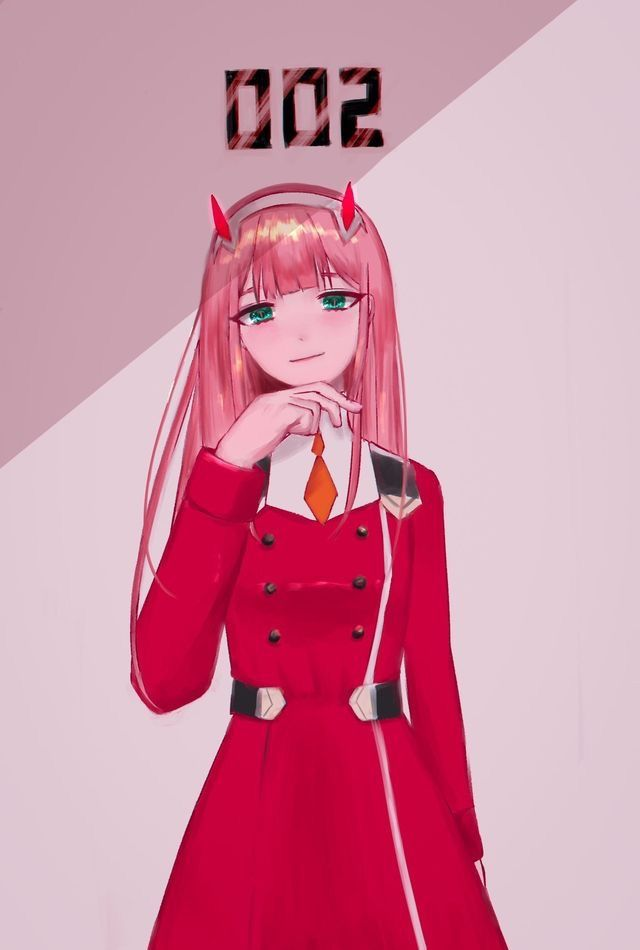

👋 **Hello! I'm notme6000**  
🚀 Passionate **Web & Game Developer** | **Cybersecurity Enthusiast** | **Tech Innovator**  

I specialize in crafting **secure and immersive web applications** and **engaging gaming experiences**. With a deep interest in cutting-edge technologies, I aim to push the boundaries of what's possible in the digital world. From sleek, interactive websites to dynamic gaming mechanics, I'm always ready to take on new challenges and bring fresh ideas to life.

### 🔧 Skills
- **Languages**: Python, JavaScript, HTML, CSS, GDScript
- **Frameworks**: Bootstrap
- **Tools**: MongoDB, VS Code, Git
- **Cybersecurity**

### 📫 Let's Connect!
- **[Website](https://notme6000.github.io)**
- **[Instagram](https://www.instagram.com/notme_6000/)**

